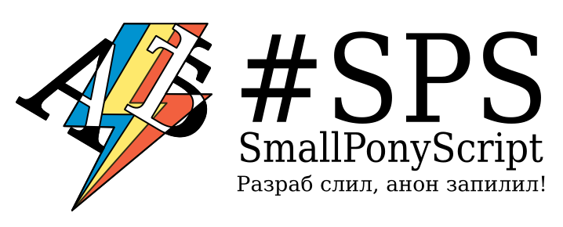

К сожалению, все устарело. Ждем 3 числа, потом будем смотреть что #починили, а что нет.

SmallPonyScript
===============

Азъесмчуй удобно!

Возможности:

- Подсветка сообщений адресованных вам
- Скрытие постов
- ОБРАЩЕНИЯ

Установка
---------
###### Firefox:

1. Установите [Greasemonkey](https://addons.mozilla.org/ru/firefox/addon/greasemonkey/) или [Scriptish](https://addons.mozilla.org/ru/firefox/addon/scriptish/)

2. Перейдите на [страничку юзерскрипта](https://raw.githubusercontent.com/mlpazesm/SmallPonyScript/master/smallpony.user.js) и установите его

###### Chrome:

1. Установите [Tampermonkey](http://tampermonkey.net/)

2. Перейдите на [страничку юзерскрипта](https://raw.githubusercontent.com/mlpazesm/SmallPonyScript/master/smallpony.user.js) и установите его

###### Chrome (альтернативный вариант):

Гайд взят с https://github.com/SthephanShinkufag/Dollchan-Extension-Tools/wiki/installation

1. Создайте папку `Chrome`

2. Сохраните туда ваш [файл скрипта](https://raw.githubusercontent.com/mlpazesm/SmallPonyScript/master/smallpony.user.js)

3. Зайдите в браузере на страницу ваших расширений, набрав в адресной строке `chrome://extensions/`

4. Установите галочку "Режим разработчика"

5. Нажмите кнопку "Загрузить распакованной расширение", укажите путь к папке, подтвердите

###### Хропера:

Аналогично хрому

###### Старая опера:

У вас старая опера? Поделитесь впечатлениями и допишите этот раздел!

###### Safari:

Возможно заработает с помощью NinjaKit. Тестов не производилось.
Автор рассмотрит возможность пожертвования в безвозмездное пользование Макинтоша для теста юзерскрипта.

###### Internet Explorer:

U mad bro?
